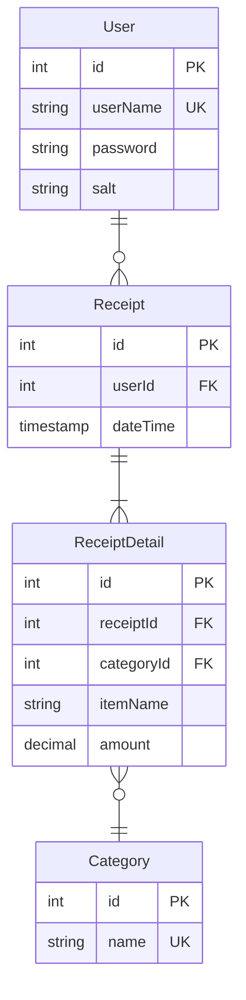

# 使用技術

- 言語: Kotlin
- フレームワーク: Ktor
- データベース: PostgreSQL
- IDE: IntelliJ IDEA（Community Edition）
- コンテナ管理: Docker
- ホスティングサービス（予定）: Render

# ER 図

```mermaid
erDiagram
User {
  int id PK
  string userName UK
  string password
  string salt
}
Receipt {
  int id PK
  int userId FK
  timestamp dateTime
}
ReceiptDetail {
  int id PK
  int receiptId FK
  int categoryId FK
  string itemName
  decimal amount
}
Category {
  int id PK
  string name UK
}
User ||--o{ Receipt : ""
Receipt ||--|{ ReceiptDetail : ""
ReceiptDetail }o--|| Category : ""
```
